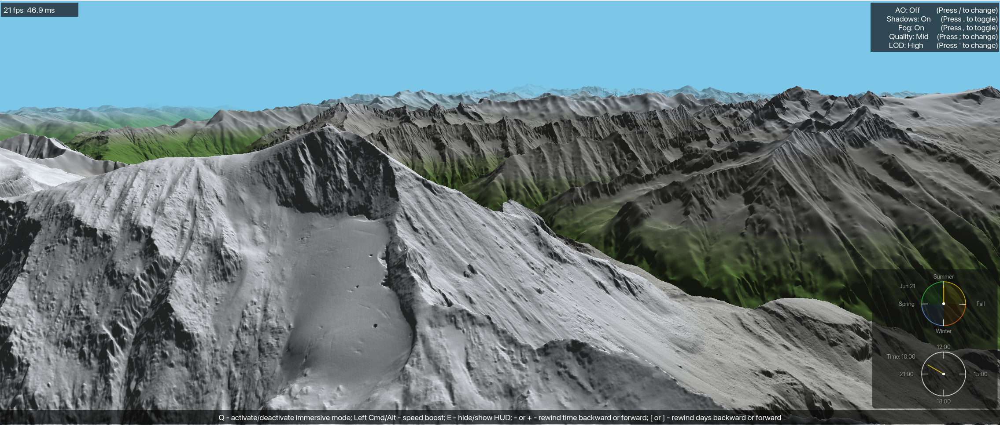

# dem-renderer

A real-time 3D terrain renderer in Rust that raymarches real-world elevation data. Streams three resolution tiers simultaneously — 30 m Copernicus GLO-30 base, 5 m BEV regional detail, and 1 m BEV fine tile — blended seamlessly in a single WGSL shader.



## Features

- **Multi-resolution terrain** — 30 m GLO-30 base grid + 5 m BEV regional detail + 1 m BEV fine tile; all blended in the raymarcher with no seams
- **Interactive fly-through** — WASD + mouse look, altitude control, 10× speed boost; tiles slide automatically as you move
- **Real sun position** — date/time-driven sun animation; shadows recomputed on-the-fly via DDA sweep as the sun moves
- **Ambient occlusion** — true hemisphere AO (16-azimuth DDA), SSAO ×4/×8/×16, and HBAO modes, all togglable at runtime
- **Fog, quality, and LOD controls** — ray-step quality and mipmap LOD presets togglable via keyboard
- **Cross-platform** — macOS (ARM + x86), Windows, Linux; wgpu auto-selects Metal / Vulkan / DX12 / OpenGL

## Data Sources

Three elevation datasets are supported. Download the ones you need.

### Copernicus GLO-30 (30 m, worldwide)

1°×1° Cloud-Optimised GeoTIFF tiles, free from AWS (no account required):

```sh
aws s3 cp s3://copernicus-dem-30m/Copernicus_DSM_COG_10_N47_00_E011_00_DEM/ \
    ./tiles/Copernicus_DSM_COG_10_N47_00_E011_00_DEM --recursive --no-sign-request
```

Download a 3×3 grid (N46–48, E10–12) with the included script:

```sh
bash download_copernicus_tiles_30m.sh
```

→ [OpenTopography](https://portal.opentopography.org/raster?opentopoID=OTSDEM.032021.4326.3) — browser-based tile selection and download.

### BEV DGM Austria (5 m and 1 m, Austria only)

High-resolution tiles from Austria's Federal Office for Metrology and Surveying (BEV).

→ [BEV GeoNetwork catalog](https://data.bev.gv.at/geonetwork/srv/eng/catalog.search#/search?isTemplate=n&resourceTemporalDateRange=%7B%22range%22:%7B%22resourceTemporalDateRange%22:%7B%22gte%22:null,%22lte%22:null,%22relation%22:%22intersects%22%7D%7D%7D&sortBy=relevance&sortOrder=desc&query_string=%7B%22resourceType%22:%7B%22dataset%22:true%7D,%22format%22:%7B%22GeoTIFF%22:true%7D%7D) — filter by GeoTIFF, select the area of interest.

Place downloaded files under `tiles/big_size/`.

### USGS SRTM 1 Arc-Second (30 m, legacy)

Available from [USGS EarthExplorer](https://earthexplorer.usgs.gov/) — search for entity ID `SRTM1N47E011V3`, dataset "SRTM 1 Arc-Second Global". Place the `.bil` / `.hdr` files under `n47_e011_1arc_v3_bil/`.

## Prerequisites

- [Rust](https://rustup.rs) stable toolchain
- Platform GPU drivers (Metal on macOS; Vulkan or OpenGL on Linux; DX12/Vulkan on Windows)
- `aws` CLI — for Copernicus tile downloads (optional)
- `gdal` — for CRS reprojection utilities (optional, see [CRS utilities](#crs-utility-commands))

## Building

### macOS — ARM / Apple Silicon

```sh
make build_arm
# or directly:
RUSTFLAGS="-C target-cpu=native" cargo build --release
```

### macOS — cross-compile for x86_64

```sh
make build_x86
# or directly:
rustup target add x86_64-apple-darwin
RUSTFLAGS="-C target-cpu=x86-64-v3" cargo build --release --target x86_64-apple-darwin
```

The resulting binary won't run on the Mac — copy it to an x86_64 machine.

### Windows

Install Rust from https://rustup.rs, then install the MSVC build tools via the Visual Studio installer (select "C++ build tools").

```powershell
cargo build --release
# or with AVX2:
$env:RUSTFLAGS="-C target-cpu=x86-64-v3"
cargo build --release
```

**NVIDIA GPU**: NVIDIA Control Panel → Manage 3D Settings → Program Settings → add `dem_renderer.exe` → set preferred GPU to "High-performance NVIDIA processor".

### Linux

```sh
# Install Rust
curl --proto '=https' --tlsv1.2 -sSf https://sh.rustup.rs | sh

# Vulkan dependencies — Debian/Ubuntu
sudo apt install build-essential pkg-config libvulkan-dev mesa-vulkan-drivers

# Fedora
sudo dnf install gcc pkg-config vulkan-loader-devel

# Build
RUSTFLAGS="-C target-cpu=native" cargo build --release
```

## Running

```sh
make view           # launch viewer (ARM native)
make view-vsync     # launch viewer with vsync on
make view-1m        # launch viewer with explicit 1 m tile directory
```

Or directly with `cargo`:

```sh
cargo run --release
cargo run --release -- --vsync
cargo run --release -- --1m-tiles-dir tiles/big_size/
```

### CLI flags

| Flag | Default | Description |
|---|---|---|
| `--vsync` | off | Cap frame rate to the display refresh rate |
| `--1m-tiles-dir <path>` | `tiles/big_size/` | Directory containing 1 m BEV tiles for the fine detail tier |

## Controls

### Movement

| Key | Action |
|---|---|
| `W` / `S` | Fly forward / backward |
| `A` / `D` | Strafe left / right |
| `Space` / `Shift` | Fly up / down |
| Left-click + drag | Look around |
| `Q` | Toggle immersive mode (capture / release cursor) |
| `Cmd` / `Alt` (hold) | 10× speed boost |

### Sun & time

| Key | Action |
|---|---|
| `+` / `-` | Advance / rewind time of day |
| `]` / `[` | Advance / rewind day of year |

Hold `Cmd` / `Alt` to run time 4× faster.

### Render toggles

| Key | Action |
|---|---|
| `E` | Toggle HUD overlay |
| `/` | Cycle AO mode — Off → True Hemisphere → SSAO ×4 → SSAO ×8 → SSAO ×16 → HBAO ×4 → HBAO ×8 |
| `.` | Toggle shadows |
| `,` | Toggle fog |
| `;` | Cycle ray-step quality preset — Ultra → High → Mid → Low |
| `'` | Cycle mipmap LOD preset — Ultra → High → Mid → Low |

## CRS utility commands

Coordinate conversions (requires `gdal`):

```sh
# WGS84 → Austria Lambert (EPSG:31287)
echo "11.667 47.100" | gdaltransform -s_srs EPSG:4326 -t_srs EPSG:31287

# WGS84 → LAEA Europe (EPSG:3035)
echo "11.687592 47.076211" | gdaltransform -s_srs EPSG:4326 -t_srs EPSG:3035

# Crop a window from a large BEV 1 m tile
gdal_translate -projwin 4446400 2665778 4450000 2662178 -of GTiff \
    tiles/big_size/1m_innsbruck_area/CRS3035RES50000mN2650000E4400000.tif \
    tiles/big_size/hintertux_3km_1m.tif
```

## Troubleshooting

### No Vulkan on Linux

wgpu defaults to Vulkan on Linux. Check availability:

```sh
sudo apt install vulkan-tools && vulkaninfo --summary
```

Install the Intel driver if missing:

```sh
sudo apt install intel-media-va-driver mesa-vulkan-drivers
```

On older Atom x5 / N3xxx hardware where Vulkan is unavailable, force the OpenGL backend:

```sh
WGPU_BACKEND=gl ./dem_renderer --view
```

Available backends: `vulkan`, `gl`, `dx12` (Windows), `metal` (macOS).

### Cargo behind a proxy

If `cargo build` fails with a network error on a git dependency, switch Cargo to the system git:

```toml
# ~/.cargo/config.toml
[net]
git-fetch-with-cli = true
```

## Architecture

See [`CLAUDE.md`](CLAUDE.md) for crate responsibilities, design decisions, and full measured performance results.

```
profiling (leaf)  →  dem_io  →  terrain  →  render_gpu  →  main.rs + src/viewer/
```

| Crate | Responsibility |
|---|---|
| `dem_io` | GeoTIFF / SRTM parsing, GLO-30 grid assembly, selective COG reads, CRS projections |
| `terrain` | Surface normals (SoA), DDA shadow sweep, true hemisphere AO — NEON + AVX2 |
| `render_gpu` | wgpu raymarcher, `GpuScene`, multi-res tier upload, single canonical WGSL shader |
| `profiling` | `cntvct_el0` / `rdtsc` cycle counters, CSV timing emitter |
