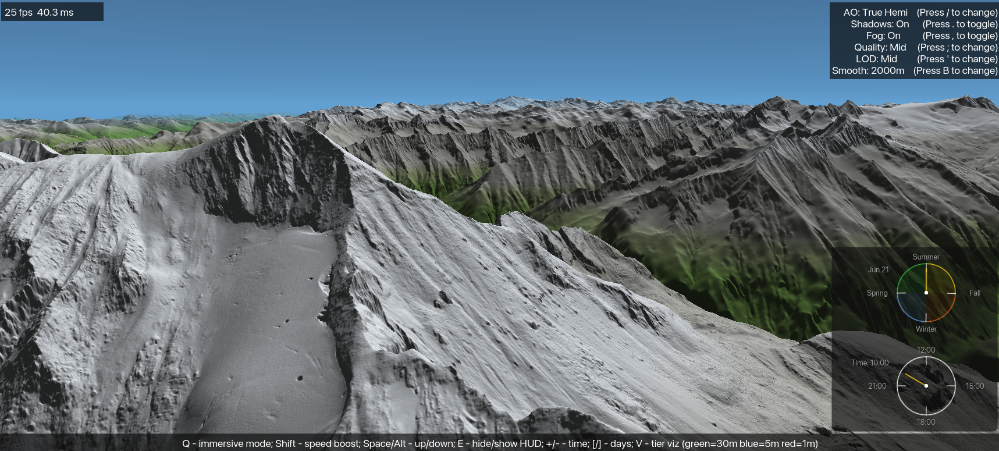

# dem-renderer

A real-time 3D terrain renderer in Rust that raymarches real-world elevation data on the GPU. Open any GeoTIFF with a recognised CRS and fly through it. When a high-resolution source is paired with coarser context tiles, the viewer streams up to three resolution tiers — coarse base / 5 m mid / 1 m fine — and blends them seamlessly in a single WGSL shader.



## Features

- **Generic CRS support** — any GeoTIFF whose CRS is in the EPSG database, or that carries WKT, works without code changes (proj4rs + proj4wkt + crs-definitions, 7-parameter Helmert shifts for MGI / DHDN / OSGB36 / ED50 / CH1903 / Tokyo / NZGD49 built in)
- **Multi-resolution terrain** — up to three streamed tiers blended in the raymarcher with no seams; feathered 500 m blend margin and per-tier rotation correction for meridian-convergence between projections
- **Built-in launcher** — egui-based UI for picking a DEM file, configuring render quality, choosing a VRAM budget preset (`Low` / `Mid` / `High`), and downloading the demo bundle; settings persist in `~/.config/dem_renderer/config.toml`
- **Graceful OOM handling** — wgpu allocation failures are caught and the renderer steps the active preset down (fine tier first, then close) with a red HUD warning, instead of panicking
- **Interactive fly-through** — WASD + mouse look, altitude control, 10× speed boost; tiles slide automatically as you move past the drift threshold
- **Real sun position** — date/time-driven sun animation; shadows recomputed on-the-fly via DDA sweep as the sun moves
- **Ambient occlusion** — true hemisphere AO (16-azimuth DDA), SSAO ×8/×16, and HBAO ×4/×8 modes, all toggleable at runtime
- **Fog, quality, LOD, and bicubic smoothing controls** — togglable from keyboard or the launcher Settings screen
- **Cross-platform** — macOS (ARM + x86), Windows, Linux; wgpu auto-selects Metal / Vulkan / DX12 / OpenGL; AVX2 on x86_64 and NEON on aarch64 are dispatched at runtime

## How it works

When you press Start the launcher hands the viewer one of three modes:

1. **Demo View** — the curated "Tirol" preset. Streams a 3-tier scene from a Copernicus GLO-30 base (Austria), the BEV DGM 5 m close tier, and two BEV 1 m fine tiles. All tile paths and the camera spawn point are stored in the user config and can be overridden — point them at any region's tiles and the demo view becomes that region.
2. **Custom file** — pick any single `.tif`. If the file is projected and has a single IFD, the viewer builds a `.tmp_dem_pre_calc_<filename>.tif` overview cache next to the source on first use (box-averaged to ~8 m and ~32 m levels), then streams the appropriate IFD into each tier from one file.
3. **Skip launcher** — set `skip_launcher = true` in `config.toml` to jump directly into the last-selected source.

The viewer spawns background workers for the base / close / fine tiers. Each worker holds WGS84 `(lat, lon)`, projects through the tile's native CRS, calls `extract_window`, recomputes normals + shadows + AO on the worker, pre-packs all GPU-ready bytes, and posts the bundle to the main thread; the main thread does only `write_texture` / `write_buffer`, so frame pacing is steady even during a reload. Detail tiers are suppressed while the camera flies at boost speed (> 2.5 km/s) and re-engage 400 ms after slowing down.

## Quick start

```sh
# 1. clone, install Rust, then:
cargo run --release

# 2. The launcher opens.
#    Either pick a .tif via "Choose files…" or press the demo button to download the
#    ~45 GB curated Austria bundle (resumable; subsequent launches reuse the cached files).

# 3. Start renders the scene and hands off to the viewer in the same window.
```

## Data Sources

The renderer is data-source-agnostic — anything with a GeoTIFF + recognised CRS works. The list below is what has actually been tested. Place anything you download under `tiles/` or `tiles/big_size/` and use **Choose files…** in the launcher.

### Copernicus GLO-30 (30 m, worldwide)

1°×1° Cloud-Optimised GeoTIFF tiles, free from AWS:

```sh
aws s3 cp s3://copernicus-dem-30m/Copernicus_DSM_COG_10_N47_00_E011_00_DEM/ \
    ./tiles/Copernicus_DSM_COG_10_N47_00_E011_00_DEM --recursive --no-sign-request
```

Convenience scripts:

```sh
bash download_copernicus_tiles_30m.sh       # 3×3 grid (N46–48 × E10–12)
bash download_copernicus_tiles_30m_5x5.sh   # 5×5 grid (N45–49 × E9–13)
```

→ [OpenTopography](https://portal.opentopography.org/raster?opentopoID=OTSDEM.032021.4326.3) — browser-based tile selection and download.

### USGS SRTM 1 Arc-Second (30 m, legacy `.bil` / `.hgt`)

Available from [USGS EarthExplorer](https://earthexplorer.usgs.gov/) — search for entity ID `SRTM1N47E011V3`, dataset "SRTM 1 Arc-Second Global".

### Austrian datasets (BEV) — used by the bundled demo view

> The original development data — kept in this section so the demo configuration is reproducible and the legacy paths still document themselves.

**BEV DGM (5 m and 1 m, Austria only)** — high-resolution tiles from Austria's Federal Office for Metrology and Surveying.

→ [BEV GeoNetwork catalog](https://data.bev.gv.at/geonetwork/srv/eng/catalog.search#/search?isTemplate=n&resourceTemporalDateRange=%7B%22range%22:%7B%22resourceTemporalDateRange%22:%7B%22gte%22:null,%22lte%22:null,%22relation%22:%22intersects%22%7D%7D%7D&sortBy=relevance&sortOrder=desc&query_string=%7B%22resourceType%22:%7B%22dataset%22:true%7D,%22format%22:%7B%22GeoTIFF%22:true%7D%7D) — filter by GeoTIFF, select the area of interest.

### USGS SRTM 1 Arc-Second (30 m, legacy)

Available from [USGS EarthExplorer](https://earthexplorer.usgs.gov/) — search for entity ID `SRTM1N47E011V3`, dataset "SRTM 1 Arc-Second Global".

The "Recommended demo view" in the launcher will download:

| File | Resolution | Source |
|---|---|---|
| `tiles/Copernicus_DSM_COG_10_N{46,47}_00_E{011,012}_00_DEM/...tif` (×4) | 30 m | Copernicus AWS S3 |
| `tiles/big_size/DGM_R5.tif` | 5 m, whole Austria, EPSG:31287 | `data.bev.gv.at` |
| `tiles/big_size/CRS3035RES50000mN2650000E4{400000,450000}.tif` (×2) | 1 m, Innsbruck + adjacent Salzburg, EPSG:3035 | `data.bev.gv.at` |

Total ~45 GB; the download is resumable (HTTP Range) and skips files that are already present at the right size.

The default camera spawn for the demo view is the Hintertux glacier tongue (47.0762° N, 11.6876° E, elev. 3258 m). You can override any of this by editing `~/Library/Application Support/dem_renderer/config.toml` on macOS (or `dirs::config_dir() / dem_renderer / config.toml` on other platforms):

```toml
vram_budget = "Mid"            # Low | Mid | High — overrides the auto-detected class

[demo_view]
camera_lat = 47.076211
camera_lon = 11.687592
camera_elev = 3258.0
fine_tile_paths  = ["tiles/big_size/CRS3035RES50000mN2650000E4400000.tif", "tiles/big_size/CRS3035RES50000mN2650000E4450000.tif"]
close_tile_paths = ["tiles/big_size/DGM_R5.tif"]
base_tile_paths  = [
  "tiles/Copernicus_DSM_COG_10_N47_00_E011_00_DEM/Copernicus_DSM_COG_10_N47_00_E011_00_DEM.tif",
  "tiles/Copernicus_DSM_COG_10_N47_00_E012_00_DEM/Copernicus_DSM_COG_10_N47_00_E012_00_DEM.tif",
  "tiles/Copernicus_DSM_COG_10_N46_00_E011_00_DEM/Copernicus_DSM_COG_10_N46_00_E011_00_DEM.tif",
  "tiles/Copernicus_DSM_COG_10_N46_00_E012_00_DEM/Copernicus_DSM_COG_10_N46_00_E012_00_DEM.tif",
]
```

Point those paths at any region's tiles and the demo view becomes that region.

## Prerequisites

- [Rust](https://rustup.rs) stable toolchain (edition 2024)
- Platform GPU drivers (Metal on macOS; Vulkan or OpenGL on Linux; DX12 / Vulkan on Windows)
- `aws` CLI — for Copernicus tile downloads (optional)
- `gdal` — for ad-hoc CRS reprojection (optional, see [CRS utilities](#crs-utility-commands))

## Building

### macOS — ARM / Apple Silicon

```sh
make build_arm
# or directly:
RUSTFLAGS="-C target-cpu=native" cargo build --release
```

### macOS — cross-compile for x86_64

```sh
make build_x86
# or directly:
rustup target add x86_64-apple-darwin
RUSTFLAGS="-C target-cpu=x86-64-v3" cargo build --release --target x86_64-apple-darwin
```

The resulting binary won't run on the Mac — copy it to an x86_64 machine.

### Windows

Install Rust from https://rustup.rs, then install the MSVC build tools via the Visual Studio installer (select "C++ build tools").

```powershell
cargo build --release
# or with AVX2:
$env:RUSTFLAGS="-C target-cpu=x86-64-v3"
cargo build --release
```

**NVIDIA GPU**: NVIDIA Control Panel → Manage 3D Settings → Program Settings → add `dem_renderer.exe` → set preferred GPU to "High-performance NVIDIA processor". (The binary also exports `NvOptimusEnablement = 1` and `AmdPowerXpressRequestHighPerformance = 1` so Optimus / Hybrid drivers route the process to the discrete GPU automatically.)

### Linux

```sh
# Install Rust
curl --proto '=https' --tlsv1.2 -sSf https://sh.rustup.rs | sh

# Vulkan dependencies — Debian/Ubuntu
sudo apt install build-essential pkg-config libvulkan-dev mesa-vulkan-drivers

# Fedora
sudo dnf install gcc pkg-config vulkan-loader-devel

# Build
RUSTFLAGS="-C target-cpu=native" cargo build --release
```

## Running

```sh
make view           # launch (ARM native)
make view-vsync     # vsync on
make config         # open config.toml in $EDITOR (vim)
make download-tiles # run the 3×3 GLO-30 download script
```

Or directly:

```sh
cargo run --release
cargo run --release -- --vsync
```

The launcher opens by default. Set `skip_launcher = true` in `config.toml` to jump straight into the last-selected source.

### CLI flags

| Flag | Default | Description |
|---|---|---|
| `--vsync` | off | Cap frame rate to the display refresh rate (overrides the config value) |

All other flags from earlier versions (`--1m-tiles-dir`, `--view`) have been removed; their behaviour is now controlled by `config.toml` or the launcher UI.


## CRS utility commands

The renderer no longer needs external CRS reprojection — it handles any EPSG CRS natively. The commands below are still useful for cropping or one-off reprojection (requires `gdal`):

```sh
# WGS84 → Austria Lambert (EPSG:31287)
echo "11.667 47.100" | gdaltransform -s_srs EPSG:4326 -t_srs EPSG:31287

# WGS84 → LAEA Europe (EPSG:3035)
echo "11.687592 47.076211" | gdaltransform -s_srs EPSG:4326 -t_srs EPSG:3035

# Crop a window from a large BEV 1 m tile
gdal_translate -projwin 4446400 2665778 4450000 2662178 -of GTiff \
    tiles/big_size/CRS3035RES50000mN2650000E4400000.tif \
    tiles/big_size/hintertux_3km_1m.tif
```

## Troubleshooting

### "No Vulkan" on Linux

wgpu defaults to Vulkan on Linux. Check availability:

```sh
sudo apt install vulkan-tools && vulkaninfo --summary
```

Install the Intel driver if missing:

```sh
sudo apt install intel-media-va-driver mesa-vulkan-drivers
```

On older Atom x5 / N3xxx hardware where Vulkan is unavailable, force the OpenGL backend:

```sh
WGPU_BACKEND=gl ./dem_renderer
```

Available backends: `vulkan`, `gl`, `dx12` (Windows), `metal` (macOS).

### Datum offset — high-res tile sits visibly east of base

If you point a national-grid tile (Austria MGI, Germany DHDN, UK OSGB36, Swiss CH1903, …) at a Copernicus / WGS84 base and see a 100–600 m horizontal offset, the source WKT is probably missing the `+towgs84` Helmert shift. The renderer applies known shifts automatically by EPSG code (see `epsg_towgs84` in `crates/dem_io/src/crs.rs`). If your CRS isn't in that table, file an issue with the EPSG code and the official 7-parameter values — or add a row to the match arm.

### `cargo build` fails behind a corporate proxy

If `cargo build` fails on a git dependency, switch Cargo to the system git:

```toml
# ~/.cargo/config.toml
[net]
git-fetch-with-cli = true
```

### Tile dimension > 8192 px

Hardware texture dimension limit. The viewer crops oversized windows around the camera automatically (see `GPU_SAFE_PX` in `src/consts.rs`). If you want a different cap, change the constant and rebuild.

### Red HUD banner: "OOM prevented — not enough VRAM"

The runtime OOM safety net fired and disabled a detail tier. The renderer keeps running on a coarser preset; no crash. To make it stop happening, open the launcher Settings and drop the **VRAM Budget** dropdown one step (`High` → `Mid` → `Low`). The choice persists in `config.toml` as `vram_budget = "..."`. See [`docs/vram-limitation.md`](docs/vram-limitation.md) for why Windows' "Shared GPU Memory" can't be used as a fallback and what the realistic options are.

## Architecture

See [`CLAUDE.md`](CLAUDE.md) for crate responsibilities, the bind-group layout, the three-tier streaming model, design-decision rationale, and the full set of measured performance results.

```
profiling (leaf)  →  dem_io  →  terrain  →  render_gpu  →  src/launcher + src/viewer
```

| Crate / module | Responsibility |
|---|---|
| `dem_io` | GeoTIFF / SRTM parsing, generic CRS via proj4rs+proj4wkt, COG window reads, grid assembly, overview-cache generation, NoData smoothing |
| `terrain` | Surface normals (SoA), DDA shadow sweep, true hemisphere AO — scalar + NEON (aarch64) + AVX2 (x86_64) with runtime dispatch |
| `render_gpu` | wgpu compute raymarcher, `GpuScene`, three-tier upload, single canonical WGSL shader, CPU-side byte packing helpers |
| `src/launcher` | egui-based start screen — DEM picker, settings, demo downloader, TOML config |
| `src/viewer` | WASD viewer, sun animation, tile streaming workers, HUD |
| `profiling` | `cntvct_el0` / `rdtsc` cycle counters, CSV timing emitter |
